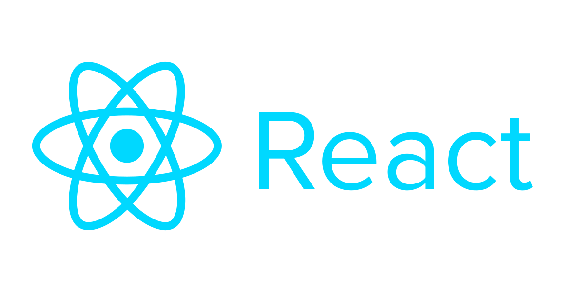

# Hi 👋, it's Dibo! 🥰

**Software Team Leader | full-stack developer | instructor | mentor**

With 10+ years of experience and challenges, and a solid knowledge of front-end, back-end, mobile development, and DevOps engineering (certified by Google) you can trust my abilities confidently.

In addition to good knowledge of other fields like e-marketing, SEO, and business development.

💬 Ask me about **Nodejs | Databases | Angular**

<section id="contact">
<h2>📲 contact me</h2>

 
 

+201556677654
</section>

## technologies  

 <h3>Frontend:</h3>
 
 
 
 
 
 

 <h3>backend:</h3>
 
 
 

 <h3>databases:</h3>
 
 
  
 
 <h3>DevOps:</h3>
 

 <h3>tools:</h3>
 
 
 
 
 

<!-- todo: github doesn't allow     -->

